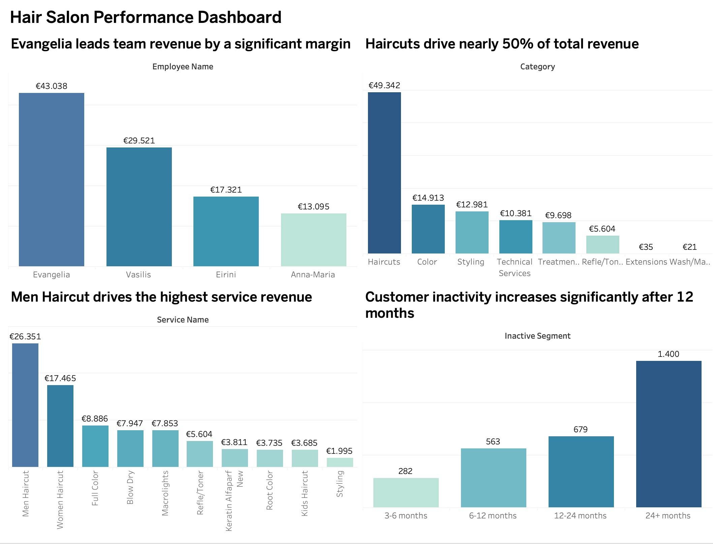

# 💇‍♂️ Hair Salon Performance Dashboard (2025)

## 📊 Project Overview
This project analyzes real business data from a hair salon using **Tableau**.

It focuses on revenue performance, service categories, employee contribution, and customer inactivity, aiming to identify actionable insights to improve business performance.

---

## 📅 Analysis Period
01/01/2025 – 31/12/2025

---

## 🎯 Business Questions
- Which employee generates the most revenue?
- Which services and categories drive the highest revenue?
- What are the most profitable service segments?
- How does customer inactivity evolve over time?
- Where are the biggest opportunities for growth?

---

## 📊 Key Insights
- 💇‍♂️ Haircuts generate nearly 50% of total revenue
- 🏆 Evangelia leads team revenue by a significant margin
- 💰 Men Haircut is the top-performing service
- 📉 A large portion of customers are inactive for 12+ months
- 📊 Strong acquisition but weak customer retention

---

## 📂 Dataset
The dataset includes:
- Employee performance
- Service categories (Haircuts, Color, Styling, etc.)
- Revenue data
- Customer inactivity segments

---

## 📈 Dashboard Features
- Revenue by employee
- Revenue by category
- Top services analysis
- Customer inactivity segmentation

---

## 🛠 Tools Used
- Tableau Public  
- Excel (Data preparation)

---

## 📷 Dashboard Preview

---

## 💡 Business Recommendations
- Implement customer reactivation campaigns (SMS / offers)
- Focus on high-value inactive customers
- Introduce loyalty programs
- Track retention and return rates

---

## 🚀 Project Structure
hair-salon-tableau-dashboard/
│
├── Data/
├── Images/
├── Recommendations/
├── README.md

---

## 📎 How to Use
1. Download the `.twbx` file  
2. Open it in Tableau Public  
3. Explore the interactive dashboard  

---

## 🔗 Connect with me
This project is part of my transition into Data Analysis.├── README.md

---

## 📎 How to Use
1. Download the `.twbx` file  
2. Open it in Tableau Public  
3. Explore the interactive dashboard  

---

## 💡 Future Improvements
- Add time-series analysis (monthly trends)
- Include customer retention metrics
- Add filters for deeper interaction

---

## 🔗 Connect with me
This project is part of my transition into Data Analysis.
